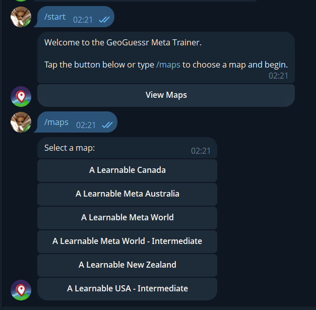
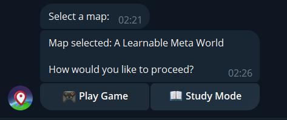
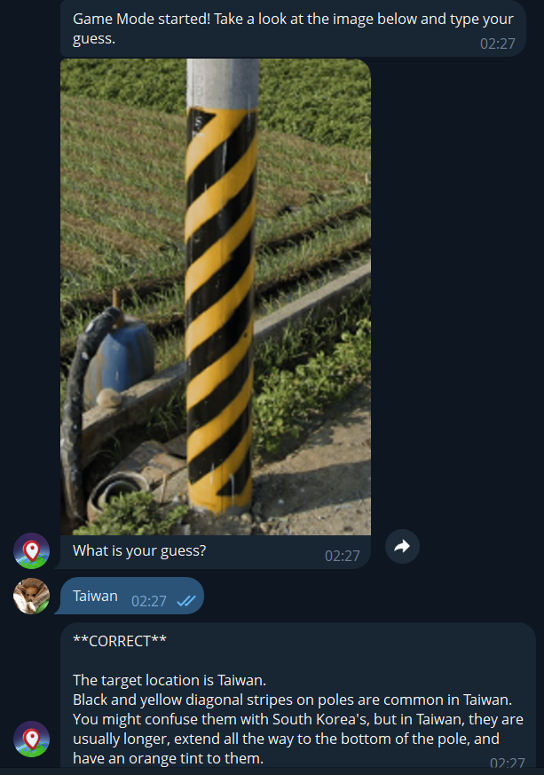
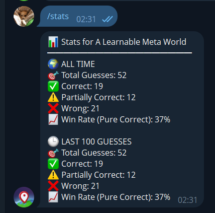
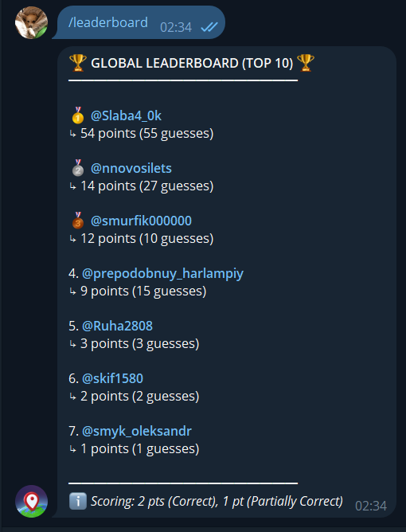

# 🌍 GeoGuessr Meta Trainer Bot

An interactive, AI-powered Telegram bot designed for gamified geography learning and practicing GeoGuessr map metas. 

The system autonomously scrapes geographic data, manages persistent multiplayer sessions, and uses Large Language Models (LLMs) to intelligently evaluate player guesses in real-time.

## ✨ Key Features

* **🤖 AI-Powered Evaluation:** Uses the Google Gemini API as an intelligent judge. It semantically analyzes user guesses, understands geographic context, ignores minor typos, and provides deterministic statuses (CORRECT, PARTIALLY_CORRECT, or INCORRECT) along with detailed explanations.
* **🧠 Dedicated Study Mode:** An educational environment where the bot retrieves and displays factual meta-data descriptions directly from the database, allowing users to memorize specific geographic cues and map patterns reliably.
* **🕵️ Autonomous ETL Scraper:** Integrated with a local PI Agent to automatically extract, clean, and load geographic metadata and visual clues from external JavaScript sources directly into Supabase cloud storage.
* **💾 Persistent Sessions:** Utilizes Supabase (PostgreSQL) to cache active game rounds. Players never lose their progress during server restarts, and concurrent user interactions are handled safely.
* **🏆 Global Leaderboard & Analytics:** Dynamic scoring system (2 pts for Correct, 1 pt for Partial). Tracks personal win rates (All-Time and Last 100 guesses) and generates a real-time Top 10 global ranking.
* **🛡️ Built-in Security:** Implements HTML-sanitization for user inputs to prevent Telegram Markdown parser crashes and strict Environment Variable isolation for all API keys.

## 📸 Screenshots

Here is a preview of the bot in action:

**Map Selection & Initialization:**
 

**Game Mode Selection:**
 

**Gameplay & AI Judge Evaluation:**
 

**Personal Statistics:**
 

**Global Leaderboard:**
 

## 🏗️ Architecture & Tech Stack

* **Backend Environment:** Node.js
* **Language:** TypeScript
* **Telegram Framework:** Grammy (Long Polling, Middlewares, Session management)
* **Database & Storage:** Supabase PostgreSQL
* **AI Orchestration:** Gemini API, PI Agent (Model Context Protocol)
* **Hosting / CI/CD:** Railway

## 🚀 Local Development Setup

### 1. Prerequisites
* Node.js (v18+)
* npm or yarn
* Supabase project & Telegram Bot Token

### 2. Clone and Install

    git clone https://github.com/Froger2702/Geoguessr-Bot.git
    cd Geoguessr-Bot
    npm install

### 3. Environment Variables
Create a .env file in the root directory and add your keys:

    SUPABASE_URL=your_supabase_url_here
    SUPABASE_SERVICE_ROLE_KEY=your_supabase_service_role_key_here
    TELEGRAM_BOT_TOKEN=your_telegram_bot_token_here
    GEMINI_API_KEY=your_gemini_api_key_here

### 4. Run the bot

    npm start

## 🎮 Telegram Commands

| Command | Description |
| :--- | :--- |
| `/start` | Initialize the bot and select a map |
| `/maps` | Display available geography maps |
| `/mode` | Toggle between 'Play' (Competitive) and 'Study' (Educational - displays meta-data from DB) |
| `/stats` | View personal win-rate analytics |
| `/leaderboard` | Check the global Top-10 rankings |
| `/geoguessr` | Link to the official GeoGuessr website |

## 👨‍💻 Author

**Oleksandr Dychkevych**  
Software Engineering Student | Lviv Polytechnic National University  
* 🐙 GitHub: [@Froger2702](https://github.com/Froger27O2)
* ✈️ Telegram: [@Slaba4_0k](https://t.me/Slaba4_0k)
